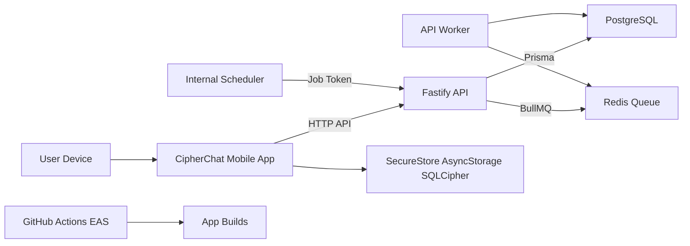

# CipherChat Threat Model

## Executive summary

CipherChat is still a prototype moving toward a secure encrypted messenger. The highest risk themes are device-session authorization, server-side encrypted-envelope metadata exposure, unsafe production use of prototype crypto boundaries, and local mobile storage migration before SQLCipher is verified in native development clients. The API already has schema validation, device-session bearer auth, rate limiting, hashed session tokens, Ed25519 challenge verification support, and metadata-only audit events, but production release must remain blocked until real Signal/MLS encryption, native encrypted storage verification, and non-prototype abuse controls are complete.

## Scope and assumptions

In scope:

- Expo React Native mobile app: `src/`
- Fastify API, Prisma persistence, Redis/BullMQ queue, worker: `apps/api/`
- CI/build/release configuration: `.github/workflows/ci.yml`, `app.json`, `eas.json`, `package.json`
- Local development services: `docker-compose.yml`

Out of scope:

- Third-party hosted infrastructure controls not represented in this repo.
- Actual Signal/MLS protocol implementation, because it is not implemented yet.
- Production push-notification provider behavior, because no provider integration exists yet.

Assumptions:

- The API will be internet reachable in production.
- Mobile clients are untrusted network clients and may be modified by attackers.
- PostgreSQL, Redis, EAS, and CI secrets are operator-controlled and should not be accessible to normal users.
- Message bodies should be opaque encrypted envelopes to the server.
- The current outbound envelope preparation is prototype plumbing, not production cryptography.
- User context was not paused for clarification in this phase because the active instruction was to continue without stopping.

Open questions that could change risk ranking:

- Will CipherChat be single-region consumer infrastructure or enterprise/multi-tenant infrastructure?
- What account recovery model will be used without weakening zero-knowledge guarantees?
- Which push notification provider and storage provider will be selected?
- What jurisdictional compliance and retention obligations apply?

## System model

### Primary components

- Mobile app: Expo React Native TypeScript UI and service layer. Evidence: `src/services/api/BackendProvider.tsx`, `src/services/api/cipherChatApiClient.ts`, `src/security/deviceIdentityProvider.ts`.
- API server: Fastify HTTP service with CORS, rate limiting, routes, Prisma repositories, and session auth. Evidence: `apps/api/src/app.ts`, `apps/api/src/server.ts`.
- Persistence: PostgreSQL via Prisma for accounts, devices, prekeys, sessions, encrypted envelopes, encrypted file metadata, abuse reports, and audit events. Evidence: `apps/api/prisma/schema.prisma`.
- Queue: Redis/BullMQ for delivery fanout and expiry work. Evidence: `apps/api/src/queue/jobQueue.ts`, `apps/api/src/worker.ts`.
- CI/release: GitHub Actions and EAS development-client config. Evidence: `.github/workflows/ci.yml`, `eas.json`, `scripts/verify-development-build-config.mjs`.

### Data flows and trust boundaries

- Mobile app -> API server: account metadata, public device bundles, signed device challenges, bearer session tokens, encrypted envelope headers/bodies, discovery queries over HTTP. Security controls include Fastify schema validation, bearer device sessions, sender-device checks, rate limiting, and CORS config. Evidence: `apps/api/src/app.ts`, `apps/api/src/routes/authRoutes.ts`, `apps/api/src/routes/messageRoutes.ts`.
- API server -> PostgreSQL: account/device/session/envelope/audit persistence through Prisma. Security controls include repository boundaries, session token hashing, challenge TTLs, envelope delivery filtering by recipient account/device, and Prisma parameterization. Evidence: `apps/api/src/repositories/prismaSessionRepository.ts`, `apps/api/src/repositories/prismaMessageRepository.ts`.
- API server -> Redis/BullMQ: delivery fanout and expiry jobs containing message IDs, counts, and timestamps. Security controls include no plaintext message payloads in queue jobs. Evidence: `apps/api/src/queue/jobQueue.ts`, `apps/api/src/jobs/processors.ts`.
- Internal scheduler/operator -> API server: internal expiry trigger over HTTP with `x-internal-job-token`. Security controls include shared token gating. Evidence: `apps/api/src/routes/maintenanceRoutes.ts`.
- Mobile app -> local storage: SecureStore stores session tokens and device private key material; AsyncStorage stores non-sensitive prototype state and some migration-pending metadata; OP-SQLite is the planned encrypted database. Evidence: `src/services/api/apiSessionStore.ts`, `src/security/deviceIdentityProvider.ts`, `src/services/local/encryptedDatabasePlan.ts`, `src/services/local/opSQLiteEncryptedLocalDatabase.ts`.
- Developer/CI -> build artifacts: npm scripts, Prisma validation, Expo Doctor, audit, EAS development-client verification. Evidence: `package.json`, `.github/workflows/ci.yml`, `docs/release/development-client-verification.md`.

#### Diagram

## Assets and security objectives

| Asset | Why it matters | Security objective (C/I/A) |
| --- | --- | --- |
| Device identity private keys | Authenticate devices and anchor safety numbers. Key theft allows impersonation. | C/I |
| Device-session bearer tokens | Authorize envelope delivery, discovery, and session operations. | C/I |
| Public device bundles and prekeys | Used to bootstrap future E2EE sessions. Tampering can enable MITM. | I |
| Encrypted envelope headers and bodies | Server should store ciphertext only, but metadata and ciphertext availability still matter. | C/I/A |
| Recipient, sender, conversation, and delivery metadata | Can reveal social graph and activity patterns even without plaintext. | C |
| PostgreSQL database | Stores accounts, devices, sessions, envelopes, audit events, and reports. | C/I/A |
| Redis queue | Drives delivery and expiry work. Queue abuse can cause DoS or stale data. | I/A |
| Audit events | Needed for abuse detection and operations without content exposure. | I/A |
| Build artifacts and CI credentials | Compromise can ship malicious clients or leak secrets. | C/I |
| Local encrypted database key | Controls access to local message/protocol state after SQLCipher integration. | C/I |

## Attacker model

### Capabilities

- Remote unauthenticated attacker can reach public API endpoints.
- Remote authenticated attacker can create or control their own account/device/session.
- Malicious client can send crafted JSON, replay old requests, manipulate local state, and choose envelope IDs and metadata.
- Network attacker may observe metadata unless transport security is correctly deployed.
- Compromised user device can expose local tokens and keys for that device.
- Insider or infrastructure attacker may see server-side metadata and operational logs.

### Non-capabilities

- Attacker cannot break Ed25519 or future reviewed Signal/MLS cryptography directly.
- Attacker cannot read plaintext message bodies from the server if client-side encryption is implemented correctly.
- Attacker does not have production database, Redis, CI, or EAS credentials by default.
- Attacker cannot bypass OS Keychain/Keystore protections without device compromise.

## Entry points and attack surfaces

| Surface | How reached | Trust boundary | Notes | Evidence (repo path / symbol) |
| --- | --- | --- | --- | --- |
| `POST /v1/accounts` | Public HTTP | Internet -> API | Creates account metadata; currently no captcha/email/abuse gate. | `apps/api/src/routes/accountRoutes.ts` `registerAccountRoutes` |
| `GET /v1/accounts/discover` | Authenticated HTTP | Mobile -> API -> DB | Returns public device bundles for discoverable accounts. | `apps/api/src/routes/accountRoutes.ts` `accounts.searchAccounts` |
| `POST /v1/auth/device-challenges` | Public HTTP | Mobile -> API -> DB | Issues short-lived challenges only for existing active devices. | `apps/api/src/routes/authRoutes.ts` |
| `POST /v1/auth/device-sessions` | Public HTTP | Mobile -> API -> DB | Verifies challenge signatures and creates bearer sessions. | `apps/api/src/repositories/prismaSessionRepository.ts` |
| `DELETE /v1/auth/device-sessions/current` | Authenticated HTTP | Mobile -> API -> DB | Revokes current bearer session. | `apps/api/src/routes/authRoutes.ts` |
| `POST /v1/devices/bundles` | Public HTTP | Mobile -> API -> DB | Publishes public prekey/device material. | `apps/api/src/routes/deviceRoutes.ts` |
| `GET /v1/devices/bundles/:accountId/:deviceId` | Authenticated HTTP | Mobile -> API -> DB | Reads active public bundle for trust sync. | `apps/api/src/routes/deviceRoutes.ts` |
| `POST /v1/messages/envelopes` | Authenticated HTTP | Mobile -> API -> DB/Queue | Stores one encrypted envelope and enqueues delivery job. | `apps/api/src/routes/messageRoutes.ts` |
| `POST /v1/messages/envelopes/fanout` | Authenticated HTTP | Mobile -> API -> DB/Queue | Stores per-recipient encrypted envelopes. | `apps/api/src/routes/messageRoutes.ts` |
| `GET /v1/messages/envelopes` | Authenticated HTTP | Mobile -> API -> DB | Lists queued envelopes only for authenticated recipient device. | `apps/api/src/routes/messageRoutes.ts` |
| `POST /v1/messages/envelopes/:messageId/ack` | Authenticated HTTP | Mobile -> API -> DB | Acknowledges only recipient-scoped envelope. | `apps/api/src/routes/messageRoutes.ts` |
| `POST /v1/internal/jobs/envelopes/expire` | Internal HTTP | Operator -> API -> Queue | Shared internal job token gates expiry jobs. | `apps/api/src/routes/maintenanceRoutes.ts` |
| Local device identity provider | Mobile runtime | App -> OS storage | Stores Ed25519 private key in SecureStore. | `src/security/deviceIdentityProvider.ts` |
| Prototype local stores | Mobile runtime | App -> AsyncStorage | Outbound queue, trust records, inbound receipt metadata pending migration. | `src/services/messages/outboundQueueStore.ts`, `src/services/messages/inboundEnvelopeStore.ts` |
| CI validation | GitHub Actions | Developer -> CI | Runs typecheck, tests, Prisma validation, integration tests, Expo Doctor, audit. | `.github/workflows/ci.yml`, `package.json` |

## Top abuse paths

1. Session impersonation: attacker steals a bearer token from a compromised device, calls inbox/discovery/envelope APIs, reads ciphertext and metadata, and acknowledges messages to disrupt delivery state.
2. Device key substitution: attacker publishes or causes acceptance of an attacker-controlled public bundle, contact sync trusts the wrong key, and future encrypted messages are sent to the attacker.
3. Metadata harvesting: attacker creates many accounts or sessions, performs discovery and envelope traffic analysis, then builds a social graph from account/device/conversation metadata.
4. Queue exhaustion: attacker uses a valid session to submit large fanout requests repeatedly, causing PostgreSQL growth, Redis job volume, and worker pressure.
5. Prototype crypto misuse: developers accidentally treat `preparePrototypeOutboundFanout` as production encryption, resulting in server-readable or weakly protected message content.
6. Local storage leakage: app migrates or stores sensitive message/protocol state before SQLCipher is verified, exposing records through AsyncStorage backups or device extraction.
7. Internal job abuse: leaked `INTERNAL_JOB_TOKEN` lets an attacker trigger repeated expiry jobs, causing availability impact or delivery-state manipulation.
8. Build-chain compromise: CI/EAS credentials or dependency supply chain are compromised, producing a malicious mobile build that exfiltrates keys and messages.

## Threat model table

| Threat ID | Threat source | Prerequisites | Threat action | Impact | Impacted assets | Existing controls (evidence) | Gaps | Recommended mitigations | Detection ideas | Likelihood | Impact severity | Priority |
| --- | --- | --- | --- | --- | --- | --- | --- | --- | --- | --- | --- | --- |
| TM-001 | Remote attacker with stolen token | Token stolen from device, logs, backup, or malicious build. | Use bearer token against inbox, discovery, bundle, and send APIs. | Ciphertext/metadata exposure, unauthorized sends, delivery disruption. | Session tokens, envelope metadata, queued ciphertext. | Tokens are hashed at rest and verified server-side in `apps/api/src/repositories/prismaSessionRepository.ts`; API requires bearer sessions in `apps/api/src/auth/deviceAuth.ts`. | Tokens are bearer-only; no device binding, rotation cadence, anomaly detection, or short-lived refresh model. | Add token rotation, per-device session management, server-side anomaly detection, optional device-bound proofs, and user-visible session revocation. | Alert on unusual IP/device token use, high inbox polling, and send spikes per session. | Medium | High | high |
| TM-002 | Malicious account/device | Attacker can create account/device or exploit weak verification UX. | Substitute public identity/prekey material so victims encrypt to attacker-controlled keys. | Future message confidentiality loss through MITM. | Device bundles, safety numbers, remote trust records. | Ed25519 challenge verifier exists in `apps/api/src/auth/signatureVerifier.ts`; local trust states exist in `src/security/remoteContactTrust.ts`. | No production account proofing, no transparency log, no key-change push, and no out-of-band verification enforcement. | Add key transparency or auditable key history, mandatory changed-key warnings, signed prekey verification, and contact verification UX gates before send. | Audit key changes, device additions, trust state transitions, and unusual bundle churn. | Medium | High | high |
| TM-003 | Authenticated spammer | Attacker has one or more valid sessions. | Submit many fanout envelopes or large ciphertext/header payloads to grow DB/queue. | Storage exhaustion, queue latency, degraded delivery. | PostgreSQL, Redis, worker availability. | Global rate limiting in `apps/api/src/middleware/rateLimit.ts`; fanout queues generic jobs in `apps/api/src/routes/messageRoutes.ts`. | No per-account quotas, envelope size policy details, recipient-count caps, or durable distributed abuse controls beyond Redis rate limit. | Enforce payload size caps, recipient fanout limits, account/device quotas, backpressure, and per-route rate limits. | Metrics for envelope count, fanout size, queue depth, DB growth, and rate-limit triggers. | Medium | Medium | medium |
| TM-004 | Remote metadata harvester | Attacker can create sessions and query discovery/delivery patterns. | Use discovery, public bundle lookups, and traffic timing to infer social graph. | Privacy loss even without plaintext access. | Account metadata, device metadata, delivery metadata. | Discovery requires authenticated device session in `apps/api/src/routes/accountRoutes.ts`; queue jobs avoid plaintext in `apps/api/src/jobs/processors.ts`. | Search is not privacy-preserving; no private contact discovery, sealed sender, metadata minimization policy enforcement, or retention limits. | Implement private contact discovery, metadata retention limits, sealed-sender-style routing where feasible, and privacy budget/rate limits for discovery. | Monitor discovery volume, graph-scraping patterns, and repeated bundle lookups. | Medium | Medium | medium |
| TM-005 | Developer or malicious client | Prototype outbound service is mistaken for production encryption. | Send messages through prototype envelope code without reviewed Signal/MLS encryption. | Server or client code may handle recoverable plaintext-derived material. | Message content, protocol state, user trust. | Security policy warns against custom crypto in `src/security/securityPolicy.ts`; outbound service is named prototype in `src/services/messages/outboundEnvelopeService.ts`; provider selection is explicit in `src/services/messages/messageEncryptionProvider.ts`; live send gating is centralized in `src/security/messageCryptoPolicy.ts`. | Real Signal/X3DH + Double Ratchet provider is still pending. | Keep live send and retry blocked until a reviewed production provider is wired, tested, and visible in Settings. | CI checks for prototype provider in production mode and audit logs for crypto provider version. | Medium | High | high |
| TM-006 | Compromised or inspected device | Device is rooted, backed up, or malware can read app storage. | Extract AsyncStorage prototype records or exportable SecureStore-held private key material. | Local metadata/key exposure and possible session impersonation. | Device private key, session token, outbound/inbound metadata. | SecureStore is used for tokens and private key in `src/services/api/apiSessionStore.ts` and `src/security/deviceIdentityProvider.ts`; migration is blocked unless encrypted DB reports encrypted in `src/services/local/prototypeStoreMigration.ts`. | SecureStore key is exportable app material today; SQLCipher native verification is pending; AsyncStorage still has prototype metadata. | Verify SQLCipher on real development clients, migrate sensitive stores, avoid plaintext backups, and investigate non-exportable Keychain/Keystore-backed keys. | App diagnostics for encrypted DB status, migration events, and unexpected plaintext-store usage. | Medium | High | high |
| TM-007 | Operator secret thief | `INTERNAL_JOB_TOKEN`, database URL, Redis URL, or CI/EAS token leaks. | Trigger internal jobs, access infrastructure, or ship malicious builds. | Availability loss, data exfiltration, malicious client release. | Infrastructure secrets, DB, queue, build artifacts. | Internal route requires `x-internal-job-token` in `apps/api/src/routes/maintenanceRoutes.ts`; CI gates in `.github/workflows/ci.yml`. | No documented secret rotation, least privilege, deploy environment separation, or release signing policy in code. | Store secrets only in managed secret stores, rotate regularly, scope CI/EAS tokens, require protected branches and signed releases. | Alert on internal route calls, secret access, unusual CI runs, and unexpected build publication. | Low | High | medium |
| TM-008 | External attacker or bot | API is internet reachable. | Abuse unauthenticated account creation/challenge endpoints for enumeration, cost, or account squatting. | Service abuse, account namespace exhaustion, operational noise. | Accounts, challenges, DB capacity. | Rate limiting covers non-health paths in `apps/api/src/app.ts` and `apps/api/src/middleware/rateLimit.ts`; challenge only issued for active existing devices in `apps/api/src/repositories/prismaSessionRepository.ts`. | No account creation abuse prevention, captcha/proof-of-work, invite policy, email/phone proof, or namespace reservation policy. | Add account creation abuse controls, username normalization/reservation, durable rate limits, and suspicious creation detection. | Metrics for account creation velocity, failed challenges, IP/device reputation, and username-squatting patterns. | Medium | Medium | medium |

## Criticality calibration

Critical:

- Server accepts or stores plaintext message bodies in production.
- Auth bypass allows cross-account envelope reads or acknowledgements.
- Build-chain compromise ships a malicious client with valid distribution trust.

High:

- Stolen session tokens allow sustained device impersonation.
- Key substitution can cause users to encrypt to attacker-controlled keys.
- Local storage stores sensitive message/protocol state outside verified encrypted storage.

Medium:

- Authenticated fanout abuse causes queue or storage exhaustion.
- Discovery or bundle lookup supports social graph scraping.
- Internal job token leak causes repeated maintenance job abuse without broader infrastructure access.

Low:

- Health/readiness endpoint leaks coarse dependency state only.
- Prototype mock mode exposes no production user data.
- Failed database readiness returns `503` without sensitive operational details.

## Focus paths for security review

| Path | Why it matters | Related Threat IDs |
| --- | --- | --- |
| `apps/api/src/auth/deviceAuth.ts` | Central bearer token extraction and session enforcement. | TM-001 |
| `apps/api/src/auth/signatureVerifier.ts` | Production device challenge signature verification. | TM-002 |
| `apps/api/src/repositories/prismaSessionRepository.ts` | Challenge TTL, session token hashing, and session lifecycle. | TM-001, TM-008 |
| `apps/api/src/routes/messageRoutes.ts` | Envelope authorization, fanout, inbox, and acknowledgement entry points. | TM-001, TM-003 |
| `apps/api/src/repositories/prismaMessageRepository.ts` | Delivery-state transitions and recipient-scoped queries. | TM-001, TM-003, TM-004 |
| `apps/api/src/routes/accountRoutes.ts` | Account creation and discovery privacy surface. | TM-004, TM-008 |
| `apps/api/src/routes/deviceRoutes.ts` | Public device bundle publication and lookup surface. | TM-002, TM-004 |
| `apps/api/src/middleware/rateLimit.ts` | Abuse control choke point for public API traffic. | TM-003, TM-008 |
| `apps/api/src/routes/maintenanceRoutes.ts` | Internal job token boundary. | TM-007 |
| `apps/api/prisma/schema.prisma` | Defines sensitive metadata and retention-impacting tables. | TM-003, TM-004, TM-007 |
| `src/security/deviceIdentityProvider.ts` | Local device private key creation, storage, signing, and rotation. | TM-002, TM-006 |
| `src/security/remoteContactTrust.ts` | Remote key trust-state handling and changed-key behavior. | TM-002 |
| `src/services/messages/outboundEnvelopeService.ts` | Prototype send envelope boundary that must not become production crypto. | TM-005 |
| `src/services/local/prototypeStoreMigration.ts` | Migration guard from AsyncStorage into encrypted database. | TM-006 |
| `src/services/local/opSQLiteEncryptedLocalDatabase.ts` | SQLCipher native adapter and encryption reporting. | TM-006 |
| `src/services/api/BackendProvider.tsx` | Mobile orchestrator for sessions, discovery, send queue, trust, and live/mock mode. | TM-001, TM-002, TM-005 |
| `.github/workflows/ci.yml` | Release gate and supply-chain control point. | TM-007 |
| `eas.json` | Native build profile configuration for production/mobile security modules. | TM-007 |

## Notes on use

- This threat model is a living engineering artifact and must be updated when Signal/MLS, push notifications, file storage, backup, account recovery, or production deployment are implemented.
- Current rankings assume internet-facing production API exposure and consumer messaging use.
- The most important release decision is that CipherChat must not handle production user content until the security acceptance criteria in `docs/security/security-acceptance-criteria.md` are satisfied.
